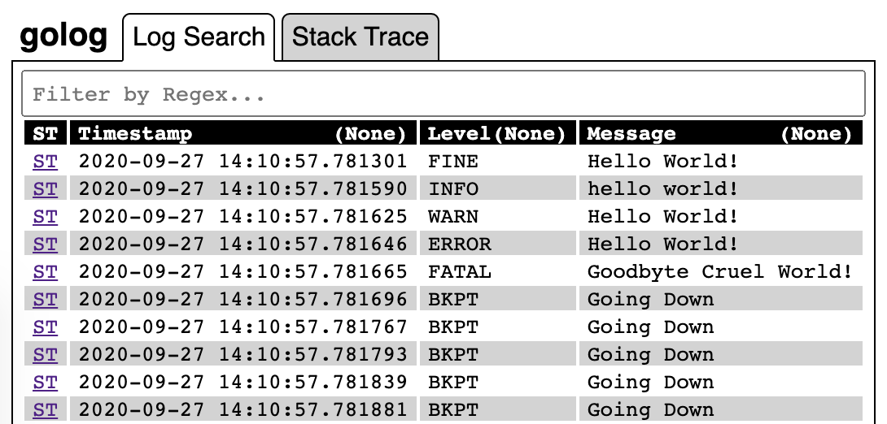
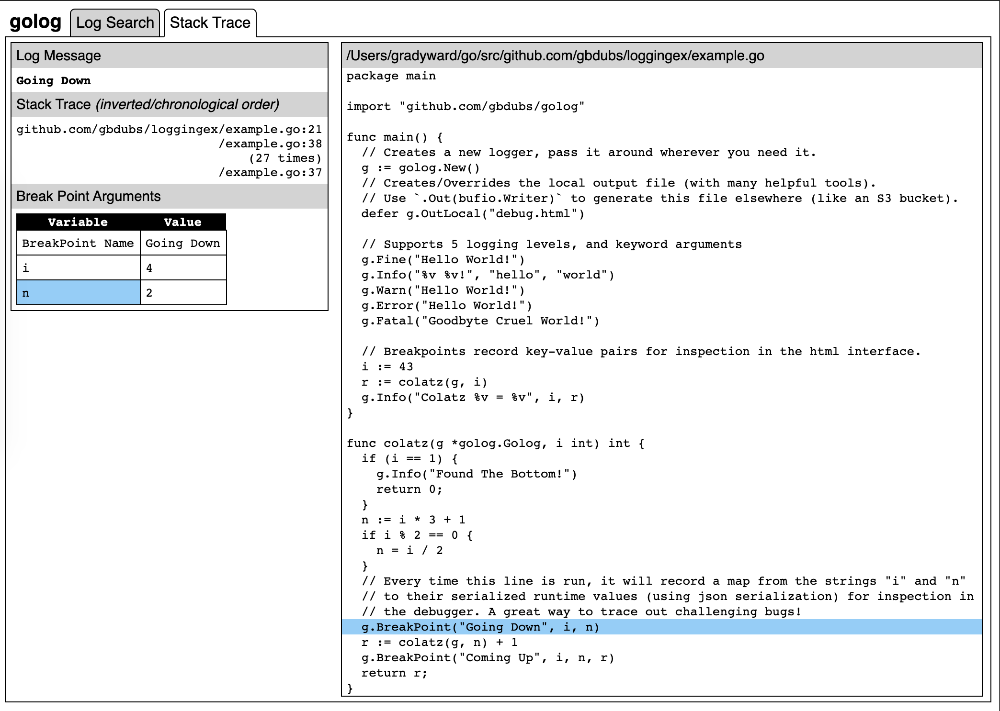

# golog - a logger for go

A logger to help you find the right logs, trace easily, and capture values at break points.

## Install

```bash
go get github.com/gbdubs/golog

```

## Usage

```go
package main

import "github.com/gbdubs/golog"

func main() {
  // Creates a new logger, pass it into the methods where you want it.
  g := golog.New()
  // Writes to a local output html file for visual debugging.
  // Use `.Out(bufio.Writer)` to generate this file elsewhere (like S3).
  defer g.OutLocal("debug.html")

  // Supports 5 logging levels, and standard string formatting.
  // Each log is recorded alongside a stack trace.
  g.Fine("Hello World!")
  g.Info("%v %v!", "hello", "world")
  g.Warn("Hello World!")
  g.Error("Hello World!")
  g.Fatal("Goodbyte Cruel World!")

  // Breakpoints record key-value pairs for inspection in the html interface.
  i := 43
  r := colatz(g, i)
  g.Info("Colatz %v = %v", i, r)
}

func colatz(g *golog.Golog, i int) int {
  if (i == 1) {
    g.Info("Found The Bottom!")
    return 0;
  }
  n := i * 3 + 1
  if i % 2 == 0 {
    n = i / 2
  }
  // Every time this line is run, it will record a map from the strings "i" and "n" 
  // to their serialized runtime values (using json serialization) for inspection in 
  // the debugger. A great way to trace out challenging bugs!
  g.BreakPoint("Going Down", i, n)
  r := colatz(g, n) + 1
  g.BreakPoint("Coming Up", i, n, r)
  return r;
}
```

## Debugging interface

After running the above, there will be a `debug.html` file that has some helpful tools:

### Log Search

Log Search supports basic log analysis, regex filtering, and sorting by column values.
To see details about any given log, click on "ST" to see it's stack trace and variables.
 


### Stack Trace

Stack Trace allows you to see a simplified call stack, click into and browse each callsite,
and see the values of the arguments passed in (in JSON format) for Breakpoints.



## TODO

1) Semantic Links between Code -> Callsites
2) Tests
3) Forward/Backward buttons on ST page
4) Pagination
5) Look into enclosing in closures to avoid eager eval
6) Maybe store logs not in monolithic file (if possible?)
7) Test limits - 1MM stack traces?
8) Automatic Instrumentation? Would be rad.
9) Get the class names etc. simplified/shared (avoid all too common misspellings)

## Future Work

This project is low priority for me - I'll keep adding features as I use it, but if you've got feature requests or want to contribute anything, please just put out a PR or an email (grady.b.ward@gmail.com).